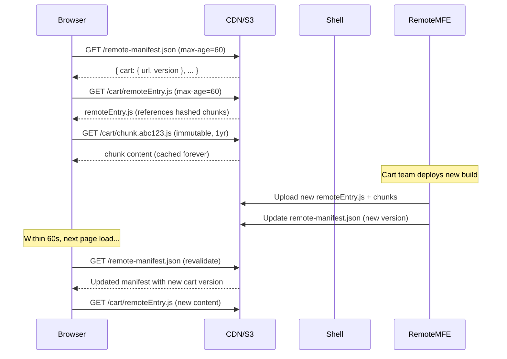

# ADR: Cache Busting Strategy for remoteEntry.js

**Status:** Proposed  
**Date:** 2026-06-16  
**Context:** Remote URLs are hardcoded to `localhost:300X` with no production strategy. `remoteEntry.js` has a static filename with no versioning. The shell must be redeployed to change remote URLs, and there's no cache invalidation mechanism when a remote MFE deploys a new build.

---

## Decision

Use a **manifest + promise-based hybrid** approach:
- Shell fetches a short-cached `remote-manifest.json` at startup listing current remote URLs/versions
- Webpack's promise-based `remotes` syntax dynamically loads `remoteEntry.js` files at runtime
- `remoteEntry.js` files have short TTL (60s); chunked assets use content-hashed filenames with long cache (1 year)
- CI auto-updates the manifest on each remote deploy

---

## Runtime Flow



---

## Implementation Plan

### Phase 1: Remote Manifest

**Step 1.** Create `remote-manifest.json` hosted on a shared S3 bucket (or the shell's CDN origin):

```json
{
  "uiKit": {
    "url": "https://cdn.example.com/ui-kit/remoteEntry.js",
    "version": "abc1234",
    "integrity": "sha384-..."
  },
  "productCatalog": {
    "url": "https://cdn.example.com/product-catalog/remoteEntry.js",
    "version": "def5678"
  },
  "cart": {
    "url": "https://cdn.example.com/cart/remoteEntry.js",
    "version": "ghi9012"
  },
  "checkout": {
    "url": "https://cdn.example.com/checkout/remoteEntry.js",
    "version": "jkl3456"
  }
}
```

**Step 2.** Set cache headers on the manifest:
- `Cache-Control: public, max-age=60, stale-while-revalidate=300`
- Browser revalidates within 60s; can serve stale for up to 5 min while refreshing in background

---

### Phase 2: Promise-based Dynamic Remotes in Shell

**Step 3.** Create `packages/shell/src/remoteLoader.ts`:

```ts
interface RemoteEntry {
  url: string;
  version: string;
  integrity?: string;
}

interface RemoteManifest {
  [remoteName: string]: RemoteEntry;
}

const MANIFEST_URL = '/remote-manifest.json';
const STORAGE_KEY = 'mfe-remote-manifest';

let manifestCache: RemoteManifest | null = null;

export async function loadManifest(): Promise<RemoteManifest> {
  if (manifestCache) return manifestCache;

  try {
    const response = await fetch(MANIFEST_URL, { cache: 'no-cache' });
    if (!response.ok) throw new Error(`Manifest fetch failed: ${response.status}`);
    manifestCache = await response.json();
    // Cache in sessionStorage as fallback
    sessionStorage.setItem(STORAGE_KEY, JSON.stringify(manifestCache));
    return manifestCache!;
  } catch (error) {
    // Fallback to last-known manifest
    const cached = sessionStorage.getItem(STORAGE_KEY);
    if (cached) {
      console.warn('[MFE] Manifest fetch failed, using cached version');
      manifestCache = JSON.parse(cached);
      return manifestCache!;
    }
    throw error;
  }
}

export function loadRemoteScript(remoteName: string, manifest: RemoteManifest): Promise<void> {
  const remote = manifest[remoteName];
  if (!remote) return Promise.reject(new Error(`Unknown remote: ${remoteName}`));

  return new Promise((resolve, reject) => {
    // Check if already loaded
    if ((window as any)[remoteName]) {
      resolve();
      return;
    }

    const script = document.createElement('script');
    script.src = remote.url;
    script.crossOrigin = 'anonymous';
    if (remote.integrity) {
      script.integrity = remote.integrity;
    }
    script.onload = () => resolve();
    script.onerror = () => reject(new Error(`Failed to load remote: ${remoteName} from ${remote.url}`));
    document.head.appendChild(script);
  });
}
```

**Step 4.** Refactor `packages/shell/webpack.config.js` to use promise-based remotes in production:

```js
const isDev = argv.mode !== 'production';

new ModuleFederationPlugin({
  name: 'shell',
  remotes: isDev
    ? {
        uiKit: 'uiKit@http://localhost:3001/remoteEntry.js',
        productCatalog: 'productCatalog@http://localhost:3002/remoteEntry.js',
        cart: 'cart@http://localhost:3003/remoteEntry.js',
        checkout: 'checkout@http://localhost:3004/remoteEntry.js',
      }
    : {
        uiKit: `promise new Promise((resolve, reject) => {
          fetch('/remote-manifest.json').then(r => r.json()).then(m => {
            const script = document.createElement('script');
            script.src = m.uiKit.url;
            script.onload = () => resolve(window.uiKit);
            script.onerror = reject;
            document.head.appendChild(script);
          }).catch(reject);
        })`,
        productCatalog: `promise new Promise((resolve, reject) => {
          fetch('/remote-manifest.json').then(r => r.json()).then(m => {
            const script = document.createElement('script');
            script.src = m.productCatalog.url;
            script.onload = () => resolve(window.productCatalog);
            script.onerror = reject;
            document.head.appendChild(script);
          }).catch(reject);
        })`,
        cart: `promise new Promise((resolve, reject) => {
          fetch('/remote-manifest.json').then(r => r.json()).then(m => {
            const script = document.createElement('script');
            script.src = m.cart.url;
            script.onload = () => resolve(window.cart);
            script.onerror = reject;
            document.head.appendChild(script);
          }).catch(reject);
        })`,
        checkout: `promise new Promise((resolve, reject) => {
          fetch('/remote-manifest.json').then(r => r.json()).then(m => {
            const script = document.createElement('script');
            script.src = m.checkout.url;
            script.onload = () => resolve(window.checkout);
            script.onerror = reject;
            document.head.appendChild(script);
          }).catch(reject);
        })`,
      },
  shared: { /* ... unchanged */ },
})
```

**Step 5.** (Optimization) Deduplicate manifest fetches — cache the promise so multiple remotes share one network request:

```js
// packages/shell/src/manifestPromise.js (loaded before remotes)
window.__mfeManifestPromise = window.__mfeManifestPromise ||
  fetch('/remote-manifest.json').then(r => r.json());
```

Then each promise-based remote uses `window.__mfeManifestPromise.then(...)` instead of separate fetches.

---

### Phase 3: Cache Headers Strategy (S3/CloudFront)

**Step 6.** Configure cache policies per file type during deployment:

| File Pattern | Cache-Control | Rationale |
|--------------|--------------|-----------|
| `remoteEntry.js` | `public, max-age=60, stale-while-revalidate=300` | Short TTL — new deploys picked up within 60s |
| `*.js` (content-hashed) | `public, max-age=31536000, immutable` | Hash changes on content change — safe to cache forever |
| `*.css` (content-hashed) | `public, max-age=31536000, immutable` | Same as JS chunks |
| `remote-manifest.json` | `public, max-age=60, stale-while-revalidate=300` | Must revalidate frequently |
| `index.html` | `no-cache, no-store, must-revalidate` | Always fresh |

**Step 7.** Implement in CI deploy scripts:

```bash
#!/bin/bash
# deploy.sh — called by each remote's GitHub Actions workflow

PACKAGE=$1  # e.g., "cart"
BUCKET=$2   # e.g., "s3://mfe-cart-prod"

# 1. Deploy hashed chunks with long cache
aws s3 sync "packages/${PACKAGE}/dist/" "${BUCKET}/" \
  --exclude "remoteEntry.js" \
  --exclude "index.html" \
  --cache-control "public, max-age=31536000, immutable" \
  --delete

# 2. Deploy remoteEntry.js with short cache
aws s3 cp "packages/${PACKAGE}/dist/remoteEntry.js" "${BUCKET}/remoteEntry.js" \
  --cache-control "public, max-age=60, stale-while-revalidate=300"

# 3. Deploy index.html with no-cache (for standalone mode)
aws s3 cp "packages/${PACKAGE}/dist/index.html" "${BUCKET}/index.html" \
  --cache-control "no-cache, no-store, must-revalidate"
```

---

### Phase 4: CI Auto-Updates Manifest on Deploy

**Step 8.** Add post-deploy step to each remote's GitHub Actions workflow:

```yaml
# .github/workflows/deploy-cart.yml
- name: Update remote manifest
  env:
    MANIFEST_BUCKET: ${{ vars.S3_BUCKET_MANIFEST }}
    CDN_ORIGIN: ${{ vars.CDN_ORIGIN }}
    CF_DISTRIBUTION: ${{ vars.CLOUDFRONT_DISTRIBUTION_ID }}
  run: |
    # Fetch current manifest
    aws s3 cp "s3://${MANIFEST_BUCKET}/remote-manifest.json" manifest.json

    # Update this remote's entry with new version (git SHA)
    jq --arg url "${CDN_ORIGIN}/cart/remoteEntry.js" \
       --arg version "${{ github.sha }}" \
       '.cart.url = $url | .cart.version = $version' \
       manifest.json > updated-manifest.json

    # Upload updated manifest with short cache
    aws s3 cp updated-manifest.json "s3://${MANIFEST_BUCKET}/remote-manifest.json" \
      --cache-control "public, max-age=60, stale-while-revalidate=300"

- name: Invalidate CloudFront cache for manifest
  run: |
    aws cloudfront create-invalidation \
      --distribution-id "${CF_DISTRIBUTION}" \
      --paths "/remote-manifest.json"
```

**Step 9.** Add concurrency guard to prevent manifest race conditions when multiple remotes deploy simultaneously:

```yaml
concurrency:
  group: remote-manifest-update
  cancel-in-progress: false  # Queue, don't cancel
```

---

### Phase 5: Fallback & Resilience

**Step 10.** Handle manifest fetch failure:
- `remoteLoader.ts` falls back to `sessionStorage`-cached manifest (last successful fetch)
- If no cached manifest exists (first visit + manifest down), `RemoteErrorBoundary` shows graceful fallback UI

**Step 11.** Version mismatch detection during long sessions:

```ts
// packages/shell/src/versionChecker.ts
let currentVersions: Record<string, string> = {};

export function startVersionPolling(intervalMs = 60_000): void {
  setInterval(async () => {
    const manifest = await fetch('/remote-manifest.json').then(r => r.json());
    const changed = Object.entries(manifest).some(
      ([name, entry]) => currentVersions[name] && currentVersions[name] !== entry.version
    );
    if (changed) {
      // Show non-intrusive toast: "Updates available — refresh for latest"
      EventBus.emit('shell:update-available', { manifest });
    }
    currentVersions = Object.fromEntries(
      Object.entries(manifest).map(([k, v]) => [k, v.version])
    );
  }, intervalMs);
}
```

---

### Phase 6: Development Experience

**Step 12.** Dev mode bypasses manifest entirely — no friction:

```js
// webpack.config.js already uses isDev check from Step 4
// localhost URLs work as before with `npm start`
```

**Step 13.** (Optional) Test dynamic loading locally with a flag:

```js
// Set DYNAMIC_REMOTES=true in .env to test manifest flow locally
const useDynamicRemotes = process.env.DYNAMIC_REMOTES === 'true';
```

---

## Files Modified

| File | Change |
|------|--------|
| `remote-manifest.json` | NEW — hosted on S3/CDN |
| `packages/shell/src/remoteLoader.ts` | NEW — manifest fetch + script loader utility |
| `packages/shell/src/versionChecker.ts` | NEW — polls for version changes |
| `packages/shell/webpack.config.js` | Refactor — promise-based remotes in production |
| `.github/workflows/deploy-*.yml` | Update — add manifest update + CloudFront invalidation |
| `scripts/deploy.sh` | NEW — deploy script with per-file cache headers |

---

## Verification Checklist

- [ ] Deploy cart MFE → within 60s, shell picks up new version without shell redeploy
- [ ] Network tab: `remoteEntry.js` returns 200 (fresh) after remote redeploy
- [ ] Network tab: hashed chunk files return `(disk cache)` on repeat visits
- [ ] Kill a remote's CDN endpoint → `RemoteErrorBoundary` shows fallback UI
- [ ] Manifest fetch failure → app loads with sessionStorage fallback URLs
- [ ] Two remotes deploy simultaneously → manifest isn't corrupted (concurrency guard)
- [ ] `npm start` (dev) → uses localhost URLs, no manifest needed
- [ ] Long session → "Update available" toast appears when remote version changes
- [ ] First-time visitor with manifest down → graceful error, not blank screen

---

## Cache Strategy Comparison (Why This Approach)

| Approach | Propagation Time | Shell Redeploy? | Complexity | Chosen? |
|----------|-----------------|-----------------|------------|---------|
| Hardcoded URLs | Never (manual) | Yes | Low | Current (broken) |
| Content-hash `remoteEntry.[hash].js` | Immediate | Yes (manifest must know hash) | High | No |
| Query string `?v=timestamp` | Immediate | Yes (shell must know version) | Medium | No |
| **Short TTL on static filename** | **≤60s** | **No** | **Medium** | **Yes** |
| Service worker + push invalidation | ~0s | No | Very High | Overkill |

---

## Risks & Mitigations

| Risk | Mitigation |
|------|-----------|
| Manifest becomes single point of failure | sessionStorage fallback + S3 99.99% SLA |
| 60s stale window during deploy | Acceptable for e-commerce; not a banking app |
| Concurrent deploys corrupt manifest | GitHub Actions concurrency group queues updates |
| CloudFront serves stale manifest beyond TTL | Explicit invalidation in CI as belt-and-suspenders |
| Promise-based remotes add complexity | Only in production; dev mode unchanged |
| Script injection (XSS via manifest) | Subresource Integrity (`integrity` field); manifest hosted on same-origin CDN |

---

## Future Considerations

- **Subresource Integrity (SRI)**: Add `integrity` hash to manifest entries; browser rejects tampered scripts
- **Canary deploys**: Manifest supports multiple versions; shell routes % of traffic to new version
- **A/B testing**: Extend manifest with `{ url, version, weight }` to serve different remote versions to different users
- **Rollback**: Revert manifest entry to previous version's URL → instant rollback without redeploying code
- **Health checks**: Ping each remote's `/health` endpoint before updating manifest (don't publish broken builds)
